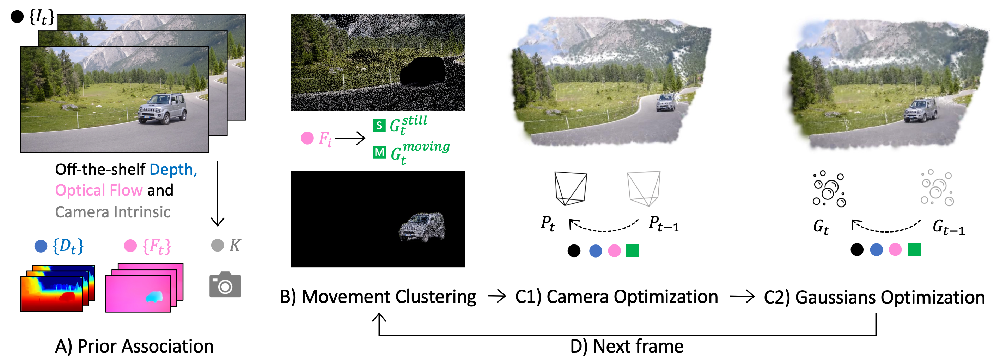

<p align="center">
  <h1 align="center">GFlow: Recovering 4D World from Monocular Video</h1>
  <p align="center">
    <a href="https://littlepure2333.github.io/home">Shizun Wang</a>
    ·
    <a href="https://adamdad.github.io/">Xingyi Yang</a>
    ·
    <a href="https://florinshen.github.io/">Qiuhong Shen</a>
    ·
    <a href="https://github.com/RoyMikeJiang">Zhenxiang Jiang</a>
    ·
    <a href="https://sites.google.com/site/sitexinchaowang/">Xinchao Wang</a>
  </p>
  <p align="center">National University of Singapore</p>
  <p align="center">AAAI 2025</p>
  <h3 align="center"><a href="https://arxiv.org/abs/2405.18426">Paper</a> | <a href="https://littlepure2333.github.io/GFlow/">Project Page</a> | <a href="https://github.com/littlepure2333/gflow">Code</a> </h3>
  <div align="center"></div>
</p>

<p align="center">
  
</p>


## Installation
1. Run `git clone --recursive https://github.com/littlepure2333/GFlow.git` to clone this repository. (If you have already cloned GFlow or found some sub-submodules missing in MSplat or MASt3R, run `git submodule update --init --recursive` to get all the submodules)
2. Install `MSplat` and `MASt3R`(especially compiling the cuda kernels for RoPE, for faster inference speed) according to the [msplat installation instruction](https://github.com/pointrix-project/msplat?tab=readme-ov-file#how-to-install) and the [MASt3R installation instruction](https://github.com/naver/mast3r?tab=readme-ov-file#installation) in the same environment.
3. Run `pip install -r requirements.txt` to install the required packages.

## Model Weights Download
### MASt3R
Refer to [MASt3R Checkpoints](https://github.com/naver/mast3r?tab=readme-ov-file#checkpoints), download the [MASt3R_ViTLarge_BaseDecoder_512_catmlpdpt_metric.pth](https://download.europe.naverlabs.com/ComputerVision/MASt3R/MASt3R_ViTLarge_BaseDecoder_512_catmlpdpt_metric.pth) and copy it to the path `./third_party/mast3r/weights/`.
### UniMatch
Refer to [UniMatch ModelZoo](https://github.com/autonomousvision/unimatch/blob/master/MODEL_ZOO.md), download the model you prefer and copy it to the path `./third_party/unimatch/pretrained/`.

We used `GMFlow-scale2-regrefine6-mixdata` model. [[download link](https://s3.eu-central-1.amazonaws.com/avg-projects/unimatch/pretrained/gmflow-scale2-regrefine6-mixdata-train320x576-4e7b215d.pth)]

## Dataset Preparation
### DAVIS
#### One-shot Script
Run `./scripts/prepare_davis.sh [gpu_id] [seg_size] [scene_graph] [unimatch_weight_path]`. The arguments are all optional, with default value described below.

The prepared dataset will be in `./data/davis/`.
#### Step-by-step
1. Download the [DAVIS 2016](https://davischallenge.org/davis2016/code.html) Dataset.
2. Unzip the compressed dataset file into your desired path(`PATH_TO_ORI_DAVIS`).
3. Run `./scripts/organize_davis.sh PATH_TO_ORI_DAVIS/JPEGImages/480p PATH_TO_TARGET_DAVIS(such as ./data/davis)` to reorganize the images' structure.
**Notes**: To make all scripts executable and convenient to run, you can add execute permission to all the script files by `chmod +x ./scripts/*.sh`.
4. Run `./scripts/depth_mast3r.sh PATH_TO_TARGET_DAVIS [gpu_id] [seg_size] [scene_graph]` to extract depth and camera (gpu_id, seg_size, scene_graph are optional with default 0, 200, 'logwin' separately).
5. Run `./scripts/flow_unimatch.sh PATH_TO_TARGET_DAVIS [unimatch_weight_path] [gpu_id]` to extract optical flow (unimatch_weight_path, gpu_id are optional with default third_party/unimatch/pretrained/gmflow-scale2-regrefine6-mixdata-train320x576-4e7b215d.pth, 0 separately).
6. Run `./scripts/move_seg.sh parent_folder [threshold] [gpu_id]` to extract the segmentation of the moving part (threshold, gpu_id are optional with default 0.5, 0).

### TAP-Vid DAVIS
This dataset is used for evaluating the model's tracking performance on DAVIS dataset.
#### Step-by-step
1. Download the [TAP-Vid DAVIS Val set](https://storage.googleapis.com/dm-tapnet/tapvid_davis.zip).
2. Unzip the compressed dataset file into your desired path (`PATH_TO_TAP_DAVIS`).
3. Run `./scripts/tapvid_davis.sh tapvid_path [davis_path]`

## Run GFlow

### Fit an image
Please refer to another repository from us [prior-driven-init-gs](https://github.com/littlepure2333/prior-driven-init-gs).

<!-- ### Simple test for reconstruct image and optimize camera
Example in `scripts/fit_2d.sh`.
```
python gflow/fit_2d.py \
        --img_path /path/to/image \
        --save_path /path/to/save/video \ 
        --num_points 10000 \            # Number of gaussian points
        --max_iter 2000 \               # Maximum number of iterations
        --seed 123 \                    # Random Seed
```
### Fit an image using texture init
Example in `scripts/fit_image.sh`.
```
python gflow/fit_image.py \
        --img_path /path/to/image \
        --depth_path /path/to/depth/image \
        --num_points 10000 \            # Number of gaussian points
        --iterations 500 \              # Number of iterations
        --seed 123 \                    # Random Seed
``` -->
### Fit a video
Example in `scripts/fit_video.sh`.
```
python gflow/fit_video.py \
    --num_points 60000 \                 # Number of Gaussian points for video processing
    --resize 480 \                       # Resize video frames to a specified size
    --lr 4e-3 \                          # Initial learning rate
    --lr_after 1e-3 \                    # Learning rate after initial iterations
    --lr_camera 0.00 \                   # Camera learning rate
    --lr_camera_after 5e-4 \             # Camera learning rate after initial iterations
    --camera_first \                     # Run camera optimization first
    --iterations_camera 150 \            # Number of iterations for camera optimization
    --iterations_first 500 \             # Initial iterations
    --iterations_after 300 \             # Iterations after the initial process
    --densify_interval 150 \             # Interval to perform densification
    --grad_threshold 5e-3 \              # Gradient threshold for densification
    --densify_times 2 \                  # Number of times to densify
    --densify_interval_after 100 \       # Densification interval after the initial iterations
    --grad_threshold_after 1e-4 \        # Gradient threshold after the initial process
    --densify_times_after 1 \            # Number of times to densify after the initial process
    --lambda_rgb 1.0 \                   # Lambda weight for RGB loss
    --lambda_depth 0.0001 \              # Lambda weight for depth loss
    --lambda_var 10.0 \                  # Lambda weight for variance loss
    --lambda_still 10.0 \                # Lambda weight for stillness loss
    --lambda_flow 0.01 \                 # Lambda weight for flow loss
    --background "black" \               # Background color (black, white, cyan)
    --frame_range -1 \                   # Range of frames to process (-1 processes all)
    --frame_start 0 \                    # Starting frame for processing
    --skip_interval 1 \                  # Interval to skip frames during processing
    --traj_num 100 \                     # Number of trajectories
    --traj_offset 2 \                    # Trajectory offset value
    --sequence_path $sequence_path \     # Path to the images sequence
    --no_common_logs \                   # Do not use common logs
    --logs_suffix "logs_cam_init_only"   # Logs suffix
```

## Evaluation
### Compute Reconstruction & Tracking & Segmentation & Camera Metrics
#### Specific Sequence
```
python gflow/benchmark \
        --log_path ./Path/to/Result \
        --sequence_path ./Path/to/Sequence \
        --csv_name "name of csv file" \
        --eval_recon True \
        --eval_track True \
        --eval_seg True \
        --eval_camera True
```
#### Whole Dataset
```
python gflow/benchmark_multi.py \
        --path ./Path/to/Dataset \
        --log_suffix "Suffix for the log directory." \
```

## View Result
Run a web viewer to view the frames.

Example in `bash scripts/run_viewer.sh`.

```
python gflow/viewer.py \
    --gpu 0 \                           # GPU you prefer to use
    --port 8088 \                       # The port to access the viewer website
    --folder "./logs/car-turn-results/" # The results folder you want to view
# The website will be localhost:8088. You may need ssh or vscode to forward the port opened on the server to your own device.
```

## Citation
```
@inproceedings{wang2025gflow,
  title={Gflow: Recovering 4d world from monocular video},
  author={Wang, Shizun and Yang, Xingyi and Shen, Qiuhong and Jiang, Zhenxiang and Wang, Xinchao},
  booktitle={Proceedings of the AAAI Conference on Artificial Intelligence},
  volume={39},
  number={8},
  pages={7862--7870},
  year={2025}
}
```

## Acknowledgement
We thank the following projects and their developers for their work:
* [MSplat](https://github.com/pointrix-project/msplat): A modular differential gaussian rasterization library
* [3DGS](https://github.com/graphdeco-inria/gaussian-splatting): 3D Gaussian Splatting for Real-Time Radiance Field Rendering
* [UniMatch](https://github.com/autonomousvision/unimatch): Unifying Flow, Stereo and Depth Estimation
* [MASt3R](https://github.com/naver/mast3r): Grounding Image Matching in 3D with MASt3R

And a big thanks to @RoyMikeJiang for helping to reorganize the code.